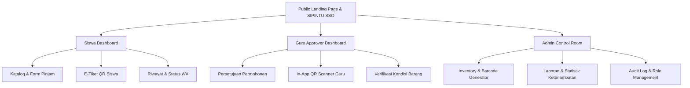

# 🎨 SIPBAR V2 — Design System & UI Specification
> **Dokumen Desain & Prompt Siap Salin untuk Google Stitch / AI UI Prototyping Tool**  
> *Sistem Informasi Peminjaman Barang & Aset Sekolah Berbasis QR Code, Multi-Role & WhatsApp Notification Integration*

---

## 📌 1. Project Overview & Brand Identity

* **Nama Produk**: SIPBAR V2 (Sistem Informasi Peminjaman Barang & Inventaris)
* **Tagline**: *"Smart, Fast, and Traceable Asset Borrowing System"*
* **Target Pengguna**: 
  * 👨‍🎓 **Siswa / Peminjam**: Eksplorasi katalog, reservasi alat, scan QR e-tiket, tracking pengembalian.
  * 👨‍🏫 **Guru / Verifikator**: Approval permohonan pinjam cepat, monitoring siswa bimbingan, verifikasi fisik.
  * 🛠️ **Admin / Inventaris**: Manajemen stok aset, cetak label QR, rekap sanksi/denda, analitik pemakaian.
* **Integrasi Eksternal**: 
  * 🔐 **SIPINTU SSO (OAuth 2.0)** login terpusat.
  * 📲 **WhatsApp Bot Gateway** notifikasi real-time & reminder deadline.

---

## 🎨 2. Design System & Style Tokens

### 🌈 Palet Warna (Modern Slate & Tech Indigo)
| Token | Hex / HSL | Deskripsi & Penggunaan |
|---|---|---|
| **Primary (Brand)** | `#4F46E5` / `indigo-600` | Tombol CTA utama, status aktif, brand highlights |
| **Primary Hover** | `#4338CA` / `indigo-700` | State hover tombol utama |
| **Secondary (Teal)** | `#0EA5E9` / `sky-500` | Aksen info, scanner scanner laser, progress bars |
| **Surface Light** | `#F8FAFC` / `slate-50` | Background utama aplikasi |
| **Card / Container** | `#FFFFFF` / `white` | Background card, floating panel, modal |
| **Text Main** | `#0F172A` / `slate-900` | Heading utama, label teks kontras tinggi |
| **Text Muted** | `#64748B` / `slate-500` | Subtitle, placeholder, timestamp |
| **Success / Available** | `#10B981` / `emerald-500` | Stok tersedia, approved, dikembalikan aman |
| **Warning / Pending** | `#F59E0B` / `amber-500` | Menunggu approval guru, mendekati jatuh tempo |
| **Danger / Overdue** | `#EF4444` / `rose-500` | Ditolak, terlambat (overdue), barang rusak |

### 🔠 Tipografi & Grid
* **Font Family**: `Plus Jakarta Sans` / `Inter`, sans-serif
* **Base Sizing**: Body `14px` (1rem), Title `18px`, Section Header `24px`, Hero Header `36px-44px`
* **Card Radius**: `rounded-2xl` (16px) untuk card & widget, `rounded-xl` (12px) untuk button & input
* **Glassmorphism Effect**: `bg-white/80 backdrop-blur-md border border-slate-200/60 shadow-sm hover:shadow-md transition-all`

---

## 📱 3. Layar-Layar Utama (Screen Breakdown)



---

## 📋 4. Google Stitch Prompt Prompts (Siap Copas per Screen)

---

### 🔹 PROMPT 1: Public Landing Page & SIPINTU SSO Portal
```text
Role: UI/UX Designer
Task: Create a modern, high-converting Landing Page for "SIPBAR V2 - School Asset & Equipment Borrowing System".

Theme & Atmosphere:
Clean, modern enterprise-edutech look. Slate-white backdrop with subtle gradient blobs (indigo & sky-blue), glassmorphism cards, and Plus Jakarta Sans typography.

Layout Structure:
1. Navbar:
   - Left: Logo "SIPBAR" with a glowing cyan-blue box cube icon.
   - Center Links: "Katalog Alat", "Alur Peminjaman", "Fitur QR", "Bantuan".
   - Right: "Status Server" indicator badge (green pulse) and "Masuk via SIPINTU SSO" (bold indigo button with OAuth shield icon).

2. Hero Section:
   - Headline: "Peminjaman Alat Lab & Multimedia Sekolah Kini Lebih Cepat & Transparan".
   - Subheadline: "Reservasi online, persetujuan guru instan via WhatsApp, dan pengambilan barang tanpa antre cukup scan QR Code."
   - Action Buttons: [Pinjam Sekarang ->] (Primary Indigo) and [Lihat Katalog Barang] (Outline Button).
   - Hero Mockup Visual: Floating 3D card displaying an interactive student borrowing badge with a live QR Code and "Status: Disetujui Guru".

3. Live Stats Bar (Counter Widget):
   - 4 Pillars: "1,240+ Total Alat", "98.5% Pengembalian Tepat Waktu", "15 Detik Rata-rata Verifikasi QR", "100% Bebas Kertas".

4. Interactive Feature Showcase (3 Cards):
   - Card 1: 📱 E-Tiket QR Cerdas (QR tiket unik per transaksi yang terenkripsi).
   - Card 2: ⚡ Integrasi Approval Guru & WA Bot (Notifikasi real-time ke HP guru & siswa).
   - Card 3: 🔍 Cek Kondisi & Logbook Digital (Pencatatan kondisi fisik barang saat serah terima).

5. Footer:
   - Quick navigation, copyright SIPBAR SMKN System, and integrated SIPINTU ecosystem badge.
```

---

### 🔹 PROMPT 2: Student Dashboard & Item Catalog (Siswa)
```text
Role: Product Designer
Task: Design an intuitive, responsive Web Dashboard for Student Borrowers ("Dashboard Siswa - SIPBAR").

Theme: Clean light mode, soft slate-50 background, rounded-2xl modern cards, vibrant status pills.

Components to Include:
1. Top Welcome Banner:
   - Greeting: "Halo, Muhammad Alfian 👋", Class: "XII Rekayasa Perangkat Lunak 1".
   - Summary Widgets (4 Grid): 
     - Active Loans (2 Barang) [Badge Blue]
     - Waiting Approval (1 Pengajuan) [Badge Amber]
     - Completed Loans (14 Selesai) [Badge Green]
     - Sanksi / Poin Tertib (100 Poin Aman) [Badge Emerald]

2. Quick Action Bar:
   - Search bar: "Cari proyektor, kamera DSLR, kabel HDMI, mikroskop..."
   - Filter dropdowns: Kategori (Multimedia, Lab Komputer, Olahraga, Elektronik), Ketersediaan (Tersedia / Sedang Dipinjam).

3. Equipment Catalog Grid (3-4 columns):
   - Card Item:
     - High-res preview image with badge "Stok: 4 Unit Tersedia" (Green).
     - Title: "Sony Alpha A6400 + Lensa Kit 16-50mm"
     - Specs preview: "Kode: BRG-MM-004 | Lokasi: Lab Multimedia 2"
     - Footer of card: Button "+ Ajukan Pinjam" (Indigo) opening an instant slide-over modal.

4. Slide-Over Modal "Formulir Peminjaman Cepat":
   - Input: Tanggal Mulai Pinjam & Jam (Datetime picker).
   - Input: Tanggal Pengembalian (Auto calculate max 3 hari).
   - Dropdown: Pilih Guru Pembimbing / Verifikator (Searchable list with teacher avatar & NIP).
   - Textarea: Keperluan Penggunaan (e.g., "Praktikum Pembuatan Video Promosi Sekolah").
   - Checkbox: "Saya setuju merawat barang dan mengembalikan tepat waktu."
   - Button: [Kirim Permohonan & Notifikasi WA]
```

---

### 🔹 PROMPT 3: Student E-Ticket & Dynamic QR Screen (Tiket Pengambilan Siswa)
```text
Role: UI/UX Designer
Task: Design the "E-Ticket Pengambilan & Pengembalian Barang" mobile & desktop card view for students in SIPBAR.

Style: Passbook / Flight Ticket aesthetic with perforated edge dividers and frosted glass texture.

Ticket Contents:
1. Ticket Header:
   - Logo: SIPBAR Official Digital Pass.
   - Status Stamp: "DISETUJUI GURU" (Vibrant Emerald Badge with checkmark).
   - Transaction ID: `#TRX-2026-0819-0042`

2. Central QR Code Display:
   - Prominent, high-contrast QR Code with SIPBAR micro-logo in the center.
   - Label: "Tunjukkan QR ini ke Petugas Lab / Scan di Scanner Mandiri".
   - Countdown / Live Refresh indicator: "QR Valid untuk sesi hari ini".

3. Item & Loan Summary Section:
   - Item Name: "Infocus LCD Projector Epson EB-X400 + Kabel HDMI 10m"
   - Peminjam: "Ahmad Rayhan (NISN: 0067829102)"
   - Guru Pembimbing yang Menyetujui: "Drs. Bambang Hidayat, M.Kom" (verified checkmark)
   - Batas Waktu Pengembalian: "Jumat, 21 Agustus 2026 - 15:00 WIB"

4. Action Toolbar:
   - [📥 Download Tiket PDF / Gambar]
   - [📲 Kirim Salinan ke WhatsApp Saya]
   - [⚠️ Laporkan Kendala Alat]
```

---

### 🔹 PROMPT 4: Teacher Approval & Verification Hub (Guru / Verifikator)
```text
Role: Senior UI Designer
Task: Design the "Teacher Approval Portal" for SIPBAR (Web Responsive Tablet & Desktop).

Layout:
1. Sticky Header:
   - Teacher Profile: "Pak Bambang Hidayat" (NIP: 19820412...)
   - Notification Bell with red indicator (3 Pending Requests)
   - Toggle Quick Action: [Buka Scanner QR Approval]

2. Filter & Tabs:
   - Tabs: "Menunggu Persetujuan (3)", "Sedang Berlangsung (8)", "Selesai (45)", "Ditolak (2)"

3. Approval Card Feed (Interactive list of pending requests):
   - Card Layout:
     - Left: Siswa Avatar, Nama Siswa, Kelas & Foto Profil.
     - Middle Details:
       - Nama Barang & Kategori ("Microphone Wireless Boya BY-WM4 Pro")
       - Durasi: "19 Ags 08:00 WIB s/d 20 Ags 14:00 WIB"
       - Alasan/Keperluan: *"Untuk kegiatan rekaman podcast OSIS di ruang audio"*
       - Status Verifikasi: "Siswa tidak memiliki tunggakan/sanksi (Track Record: ⭐⭐⭐⭐⭐)"
     - Right Actions:
       - Button [Tolak (X)] (Rose outline) -> opens quick reason dropdown.
       - Button [Setujui & Terbitkan QR (✔)] (Emerald solid with hover ripple effect).

4. Real-time Status Toast:
   - Floating toast notification at bottom right: "Notifikasi WA terkirim otomatis ke siswa saat tombol Setujui ditekan."
```

---

### 🔹 PROMPT 5: Dedicated In-App Camera QR Scanner (Admin / Petugas / Guru)
```text
Role: Mobile-First Web UI Designer
Task: Design the In-App "QR Code Scanner & Verification Terminal" for SIPBAR Lab Officers.

Visual Style: Dark Mode Camera Viewport (`#0F172A`) with high-tech neon cyan HUD scanning guidelines and audio feedback cues.

Elements:
1. Top Viewport Controls:
   - Back button, Flashlight Toggle button [⚡ Torch On], Camera Switcher (Front/Back).
   - Mode Selector Pills: [Mode: Pengambilan Barang] | [Mode: Pengembalian Barang]

2. Main Scanner Viewfinder:
   - Transparent square viewfinder with animated glowing cyan laser line moving vertically.
   - Instruction Banner below viewfinder: "Arahkan kamera ke QR E-Tiket Siswa atau Label Barcode Barang".

3. Instant Result Popup Modal (Bottom Sheet triggered upon successful scan):
   - Success sound vibration indicator.
   - Identity Match:
     - Foto Siswa, Nama, Kelas.
     - Barang: "Canon EOS 3000D Kit"
     - Checklist Kondisi Barang:
       - [x] Body Mulus
       - [x] Lensa Bersih tanpa jamur
       - [x] Baterai & Charger Lengkap
       - [x] SD Card 64GB Terpasang
   - Catatan Tambahan Input Field: "Kondisi fisik normal, baterai 90%".
   - Final Action Button: [Konfirmasi Serah Terima & Update Status ke 'Dipinjam'] (Vibrant Green Button).
```

---

### 🔹 PROMPT 6: Admin Modern Inventory Control & Life-Cycle Dashboard
```text
Role: Enterprise Dashboard Designer
Task: Design a comprehensive Admin Backoffice Dashboard for "SIPBAR Inventory & Asset Management".

Theme: Sleek modern SaaS UI, subtle border-slate-200, crisp typography, data-dense yet clean layout.

Dashboard Components:
1. Metric KPI Row (4 Cards):
   - Total Aset Terdaftar: `428 Unit` (+12 unit bulan ini)
   - Sedang Dipinjam: `38 Unit` (87% utilizasi lab)
   - Keterlambatan (Overdue): `2 Unit` (Alert Red Pulse)
   - Aset Perlu Maintenance: `5 Unit` (Amber)

2. Main Data Table "Kelola Inventaris & Cetak QR":
   - Table Controls: Search, Filter by Ruangan (Lab RPL, Lab Multimedia, Lab Fisika, Gudang Utama), Bulk Print QR Button.
   - Columns:
     - [ ] Checkbox
     - Kode Barang (`BRG-MM-001`) with copy button
     - Nama Barang & Thumbnail Foto
     - Kategori (Tag badge)
     - Total Stok / Stok Tersedia (e.g. `8 / 10`)
     - Kondisi (Baik: 9, Rusak Ringan: 1)
     - Aksi: [Cetak Stiker QR] [Edit] [History Pinjam] [Hapus]

3. Integrated Quick-Print QR Label Preview Modal:
   - Preview grid of 3x3 ready-to-print barcode stickers with School Logo, Asset Name, and crisp vector QR Code.
   - Button [Print Sticker (A4 / Thermal Label 50x30mm)].

4. Live Activity Log Feed (Sidebar Widget):
   - "Ahmad baru saja mengembalikan Proyektor Epson (Kondisi: Baik) - 2 menit lalu"
   - "Pak Bambang menyetujui peminjaman Kamera DSLR - 15 menit lalu"
   - "Bot WA mengirim reminder pengembalian ke 4 siswa - 1 jam lalu"
```

---

## 🛠️ 5. Komponen UI Reusable (Component Specifications)

### 1. Status Badges
* `Pending Guru`: `bg-amber-50 text-amber-700 border-amber-200 font-medium px-2.5 py-1 rounded-full text-xs`
* `Disetujui / Ready`: `bg-blue-50 text-blue-700 border-blue-200 font-medium px-2.5 py-1 rounded-full text-xs`
* `Sedang Dipinjam`: `bg-purple-50 text-purple-700 border-purple-200 font-medium px-2.5 py-1 rounded-full text-xs`
* `Dikembalikan (Selesai)`: `bg-emerald-50 text-emerald-700 border-emerald-200 font-medium px-2.5 py-1 rounded-full text-xs`
* `Terlambat / Overdue`: `bg-rose-50 text-rose-700 border-rose-200 font-semibold px-2.5 py-1 rounded-full text-xs animate-pulse`

### 2. WhatsApp Integration Card (Simulation Widget)
* Card simulasi balon chat WhatsApp hijau (`#DCF8C6`) dengan centang biru ganda:
  > *"Halo Ahmad, permohonan pinjam [Sony Alpha A6400] telah **DISETUJUI** oleh Guru Pembimbing (Pak Bambang). Silakan tunjukkan QR tiket Anda ke petugas lab sebelum pukul 14:00 WIB. Link Tiket: sipbar.id/t/TRX042"*

---

## 🚀 6. Cara Menggunakan Dokumen Ini di Google Stitch
1. **Buka Google Stitch** (atau tool AI UI generator pilihan Anda).
2. **Pilih screen yang ingin digenerate** (misal: *Landing Page*, *Dashboard Siswa*, *QR Scanner*, atau *Admin Inventory*).
3. **Copy teks di dalam blok code PROMPT (1 s/d 6)** di atas.
4. **Paste ke input prompt Google Stitch** dan jalankan generate.
5. Anda akan mendapatkan desain UI wireframe / mockup interaktif berstandar tinggi yang sesuai 100% dengan arsitektur SIPBAR V2!
